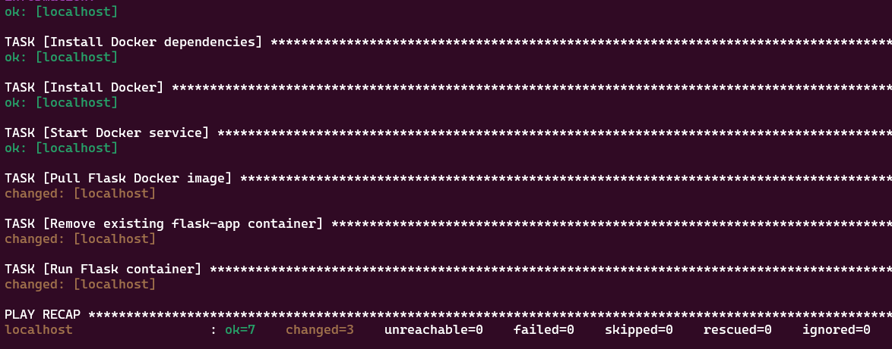
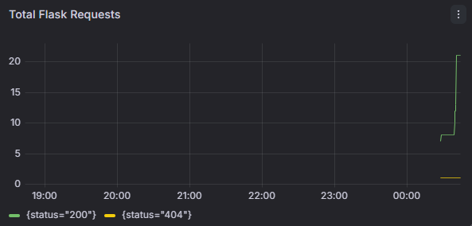
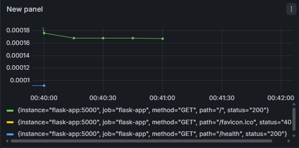
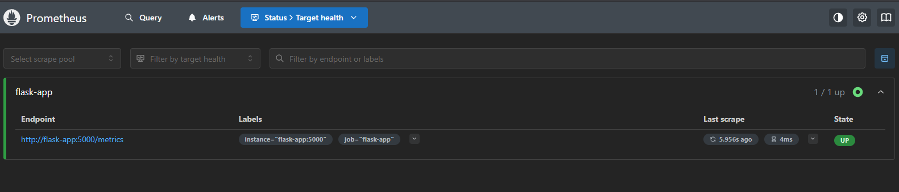

# 🚀 Flask DevOps Pipeline — Docker | Kubernetes | CI/CD | AWS ECS | Terraform | Ansible | Monitoring


A production-style DevOps project built from scratch — a Python Flask app containerized with Docker, orchestrated with Kubernetes, deployed to **AWS ECS Fargate**, with static files on **S3**, secure access via **IAM roles**, infrastructure provisioned using **Terraform**, server configuration automated with **Ansible**, and live metrics tracked via **Prometheus + Grafana**.

---

## 🏗️ Architecture

```
Developer (git push)
        │
        ▼
GitHub Actions (CI/CD Pipeline)
        │
        ├── Install dependencies
        ├── Build Docker image
        └── Push to Docker Hub
                │
                ├──► AWS ECS Fargate (Live Deployment)
                │         ├── Pulls image from Docker Hub
                │         ├── Runs Flask container (port 5000)
                │         └── Serves static files from AWS S3
                │                   └── IAM Role → secure S3 access
                │
                ├──► Terraform → Provisions EC2 + Security Group
                │         └── Ansible → Installs Docker + Deploys container
                │
                └──► Prometheus + Grafana → Live Monitoring Dashboard
```

---

## 🛠️ Tech Stack

| Layer | Technology |
|-------|-----------|
| Application | Python 3.10, Flask |
| Containerization | Docker |
| Orchestration | Kubernetes (Minikube) |
| CI/CD | GitHub Actions |
| Container Registry | Docker Hub |
| Cloud Deployment | AWS ECS Fargate |
| Static Files | AWS S3 |
| Access Control | AWS IAM Roles |
| Infrastructure as Code | Terraform |
| Configuration Management | Ansible |
| Monitoring | Prometheus + Grafana |

---

## ✨ Features

- ✅ Flask app containerized with Docker
- ✅ Kubernetes deployment with 2 replicas (local)
- ✅ Automated CI/CD — every push triggers build & push to Docker Hub
- ✅ Live deployment on AWS ECS Fargate
- ✅ Static assets served from AWS S3
- ✅ IAM role attached to ECS task for secure S3 access
- ✅ EC2 + Security Group provisioned via Terraform (IaC)
- ✅ Ansible playbook automates Docker install and container deployment
- ✅ Prometheus + Grafana monitoring with live dashboards

---

## 📁 Project Structure

```
├── app/
│   ├── app.py                  # Flask application with Prometheus metrics
│   ├── requirements.txt        # Python dependencies
│   └── Dockerfile              # Docker image definition
├── k8s/
│   ├── deployment.yaml         # Kubernetes deployment (2 replicas)
│   └── service.yaml            # Kubernetes NodePort service
├── terraform/
│   ├── main.tf                 # EC2 + Security Group resources
│   ├── variables.tf            # Input variables
│   └── outputs.tf              # Output values (public IP)
├── ansible/
│   ├── inventory.ini           # Target hosts
│   └── playbook.yml            # Automate Docker + container deployment
├── monitoring/
│   └── prometheus.yml          # Prometheus scrape config
├── docker-compose.yml          # Flask + Prometheus + Grafana stack
├── .github/
│   └── workflows/
│       └── ci.yml              # GitHub Actions CI/CD pipeline
└── README.md
```

---

## ⚙️ CI/CD Pipeline

Triggered automatically on every push to `main`:

```
git push → Install deps → Build Docker image → Push to Docker Hub
```

**Secrets required in GitHub → Settings → Actions:**

| Secret | Value |
|--------|-------|
| `DOCKER_USERNAME` | Docker Hub username |
| `DOCKER_PASSWORD` | Docker Hub access token |

---

## 🐳 Docker

```bash
cd app
docker build -t sna-app .
docker run -p 5000:5000 sna-app
```

Visit: `http://localhost:5000`

Live image: `docker.io/syedmaaz001/sna-app:latest`

---

## ☸️ Kubernetes (Local)

```bash
minikube start
kubectl apply -f k8s/deployment.yaml
kubectl apply -f k8s/service.yaml
minikube service sna-service
```

---

## ☁️ AWS ECS Fargate Deployment

| Service | Purpose |
|---------|---------|
| ECS Fargate | Serverless container hosting |
| ECR | Private Docker image registry |
| S3 (`sna-static-files`) | Static file storage |
| IAM (`sna-ecs-s3-role`) | Secure S3 read access for ECS |
| Security Group | Allow inbound traffic on port 5000 |

---

## 🏗️ Terraform (Infrastructure as Code)

```bash
cd terraform
terraform init
terraform plan
terraform apply
terraform destroy  # cleanup when done
```

**What Terraform creates:**
- EC2 instance (`t3.micro`) with Docker pre-installed
- Security Group allowing port 5000 and SSH
- Auto-pulls Docker image and starts Flask app via `user_data`

---

## 🤖 Ansible (Configuration Management)

```bash
cd ansible
ansible-galaxy collection install community.docker
ansible-playbook -i inventory.ini playbook.yml --ask-become-pass
```

**What Ansible automates:**
- Installs Docker and dependencies
- Starts Docker service
- Pulls Flask image from Docker Hub
- Runs container with auto-restart policy

---

## 📊 Monitoring — Prometheus + Grafana

```bash
docker compose up --build
```

| Service | URL |
|---------|-----|
| Flask App | http://localhost:5000 |
| Prometheus | http://localhost:9090 |
| Grafana | http://localhost:3000 (admin/admin) |

**Metrics tracked:**
- `flask_http_request_total` — total requests by endpoint and status
- `flask_http_request_duration_seconds` — response latency

---

## 📸 Screenshots

### Ansible Playbook — Successful Run


### Grafana — Request Latency Dashboard


### Grafana — Total Flask Requests


### Prometheus — Flask Target UP


---

## 🚀 Quick Start

```bash
git clone https://github.com/MaazAhmed47/devops-flask-aws.git
cd devops-flask-aws
cd app
docker build -t sna-app .
docker run -p 5000:5000 sna-app
```

---

## 👨‍💻 Author

**Syed Maaz Ahmed** — IT Student, SSUET Karachi, Pakistan

[](https://linkedin.com/in/maaz-ahmed-abb422295)
[](https://github.com/MaazAhmed47)
